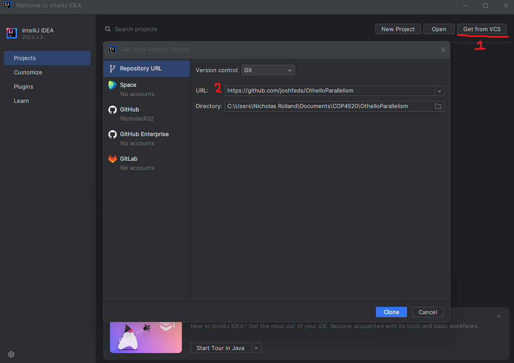
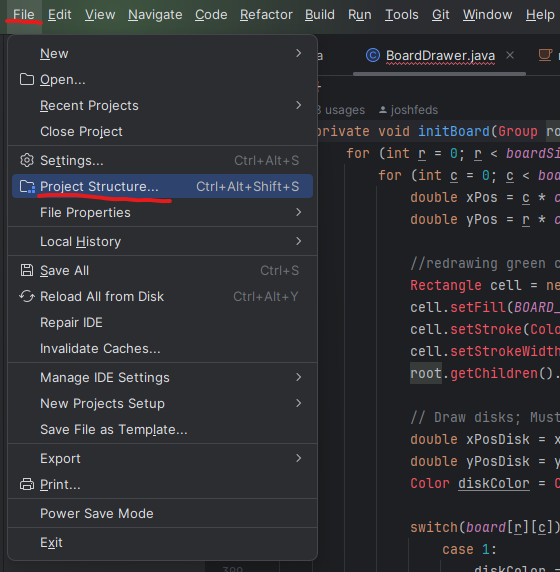
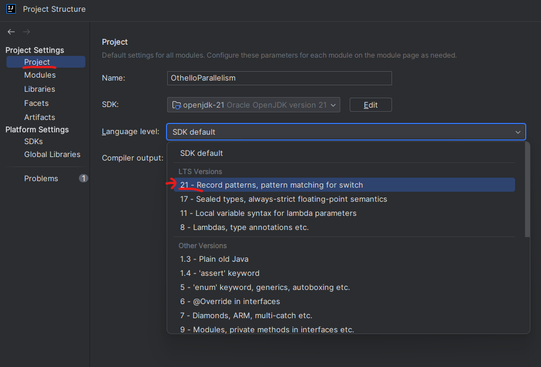
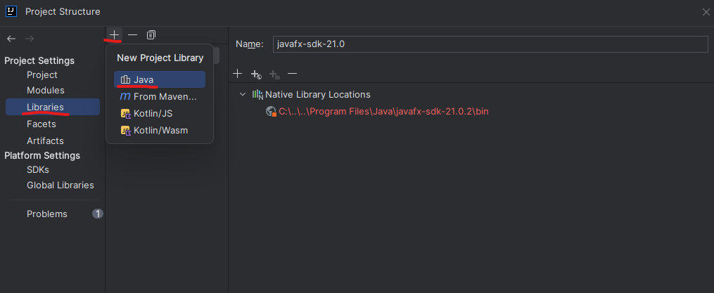
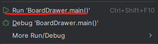

# How to compile and play our fun project

## Option 1: Using IntelliJ
1. Install [Java 21](https://www.oracle.com/java/technologies/javase/jdk21-archive-downloads.html), if for some reason you don't have it already.

2. Install [JavaFX](https://gluonhq.com/products/javafx/):
    
    a. On the Gluon site, download the JavaFX SDK for your operating system. For example, click this one if you have Windows:
    

    b. After downloading the zip, extract the contents to a desired location on your computer, e.g., Program Files. Remember where you saved the SDK for later.
    

3. Install [IntelliJ Community Edition](https://www.jetbrains.com/idea/download/?section=windows). (Scroll down, it's under the "Ultimate" Edition.)

4. Open IntelliJ. Click "Get from VCS" in the top right, then clone the repo by pasting the URL: `https://github.com/joshfeds/OthelloParallelism`. You may have to log in to GitHub.

5. After cloning, you'll notice BoardDrawer.java has hundreds of errors, since JavaFX has not been fully integrated yet. Let's fix that.

    a. Go to `File → Project Structure`.
    

    b. Under `Project`, go to `Language Level`, and select Java 21 .
    

    c. Under `Libraries`, click `New Project Library`, then `Java`.
    
    Find where you saved the JavaFX SDK folder, select the `lib` folder, then click OK.
    

The errors should hopefully disappear.

6. Finally, open `BoardDrawer.java`, right click, and run.

A window with our game will appear, and you can play against the first iteration of our AI. Good luck.

